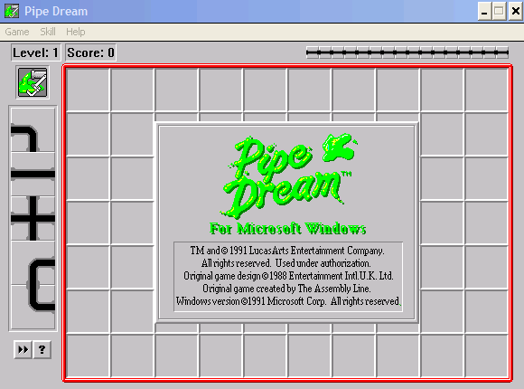
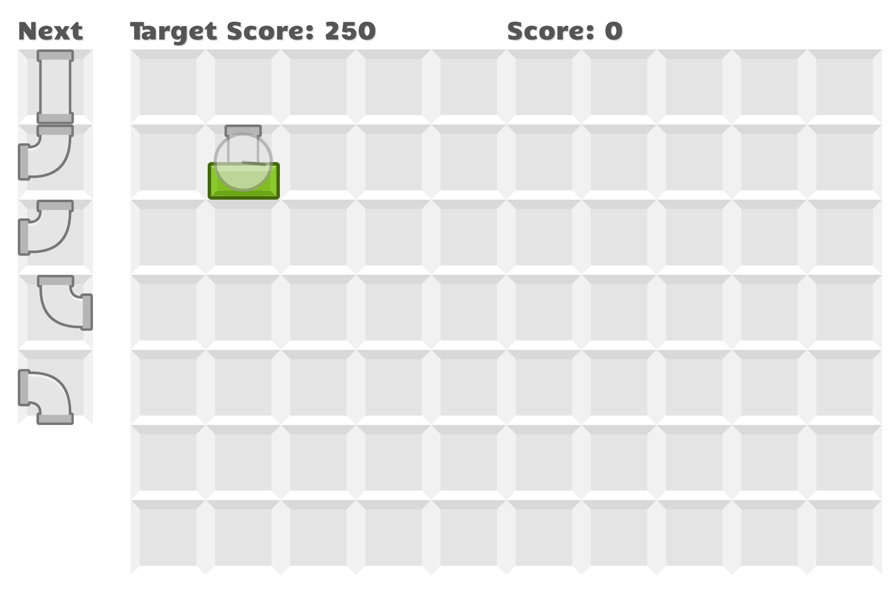

# pipe-dream
A web clone of the Pipe Dream (Pipe Mania) game for Windows 3.1.

This is by no means a complete replica, but it has the same basic gameplay as Pipe Dream / [Pipe Mania](https://en.wikipedia.org/wiki/Pipe_Mania).

## Rules
* To place a pipe, click an empty square. The pipe cannot be rotated, only placed.
* To replace a tile, just click the occupied square.
* The queue shows upcoming tiles.
* The water begins flowing after the timer counts down. Score points by connecting pipes to the start pipe.
* Press [SPACEBAR] to speed up the flow and score extra points!

## Contributing

To build:

* `npm start` to run the development server (with hotloading)
* `npm run prod` to output the production build as `public/bundle.js`

This project uses React and webpack.

## Credits

* Pipe images and background tile from [kenney.nl](http://kenney.nl/)!
* Sound files from Open Game Art:
[tile click](http://opengameart.org/content/forward-button-press-ui-sound)
[explosion](http://opengameart.org/content/9-explosion-sounds)
